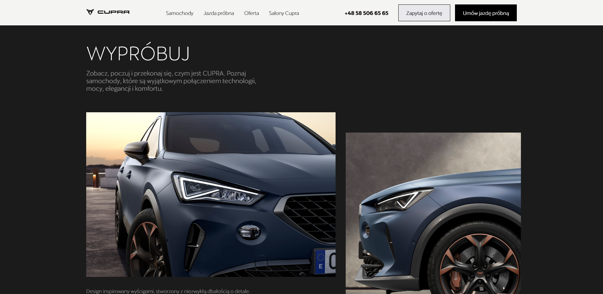

# Cupra landing page clone

This project aims to replicate the sleek and visually appealing design of the Cupra landing page. By leveraging HTML, CSS, JavaScript and React we've recreated the layout, and interactive elements to provide users with an immersive experience reminiscent of the original site.

## Key Features

- Accurate visual representation of the Cupra landing page layout.
- Responsive design for seamless browsing on various devices.
- Possible inclusion of JavaScript for enhanced interactivity.

## Get Started

- npm install
- npm run dev
